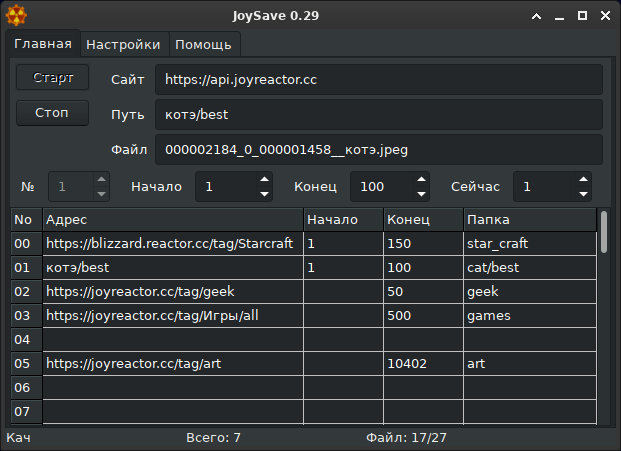

# JoySave

Программа для сохранения контента с сайта ["Joyreactor.cc"](https://joyreactor.cc) и его производных. 

- Системные требования ["версии для Windows"](https://github.com/corax4/JoySave/releases/download/v33.0.0/JoySave_Windows_v33.zip): Windows 2000 или новее.

- Системные требования ["версии для Linux x64"](https://github.com/corax4/JoySave/releases/download/v33.0.0/JoySave_Linux_v33.tar.gz): GTK-2.

- Системные требования ["версии для MacOS"](https://github.com/corax4/JoySave/releases/download/v33.0.0/JoySave_MacOS_v33.tar.bz2): MacOS 10.12.

Установка не требуется - распакуйте и запускайте. Исходники содержатся в исполняемом файле (запустите прогу с ключем sources).
